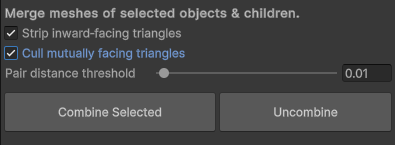


Mesh Combiner Tool is a Unity Editor extension that lets you merge meshes (and their children) into a single optimized mesh at editor time. 
It is usefull for reducing draw calls and improving performance.

## Features

* **Combine Multiple Meshes**
  Merge selected GameObjects (including all children) into one mesh with a single MeshFilter & MeshRenderer.
* **Back-Face Stripping**
  Optionally remove inward-facing triangles to cut away hidden geometry.
* **Mutual-Face Culling**
  Cull pairs of nearly opposite faces within a configurable distance threshold to eliminate internal geometry overlaps.
* **Hierarchy Preservation & Restoration**
  Captures each object’s parent, sibling index, and local transform so you can “Uncombine” and restore your exact original hierarchy, transforms, and activation states.
* **Collider Copying**
  Retains colliders on the combined mesh by duplicating the original GameObjects colliders.
* **Tag & Layer Unification**
  If all sources share the same tag or layer, the combined mesh inherits it automatically.
* **Undo Support**
  Full integration with Unity’s Undo system for all operations.




## Installation

1. **Via Git URL (Package Manager)**

    * Open Unity’s **Window → Package Manager**
    * Click the **+** button → **Add package from git URL…**
    * Enter:

      ```
      https://github.com/Stefaaan06/Unity-Mesh-Combiner.git
      ```
2. You can now open the tool window under **tools** -> **Mesh Combiner**.

## Usage

1. In the Unity Editor, select one or more GameObjects (any of them may have children with MeshFilters).
2. Go to **Tools → Mesh Combiner** to open the combiner window.
3. Toggle options as desired:
4. 
    * **Strip inward-facing triangles**
    * **Cull mutually facing triangles** (and adjust the **Pair distance threshold**)
5. Click **Combine Selected**
6. 
    * Selected meshes are hidden under an `_oldMesh` group
    * A new `_combined` GameObject is created, with combined geometry, materials, tags, layers, and colliders
7. To revert, select the combined GameObject in the Hierarchy and click **Uncombine**

    * Restores original meshes, hierarchy, transforms, and deletes the combined object

## Contribution

Any contribution is welcome as there is still a lot to improve and add:
- Better readme with more images or gifs
- Better workflow for editing merged meshes. Right now you have to Uncombine -> edit the objects -> Combine again
- More and better optimisation methods
